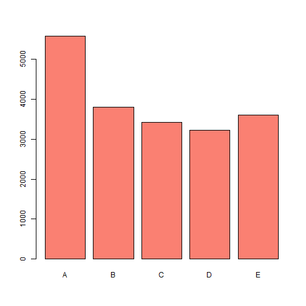
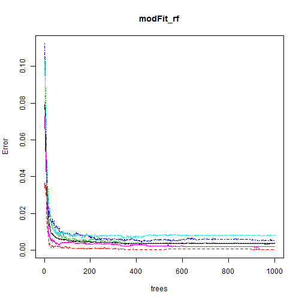
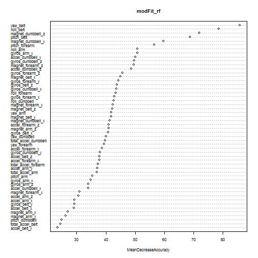
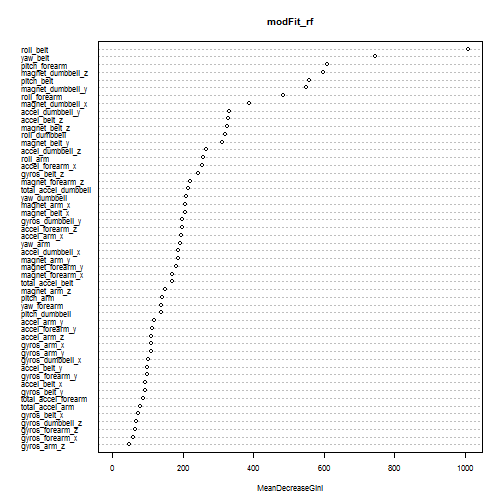
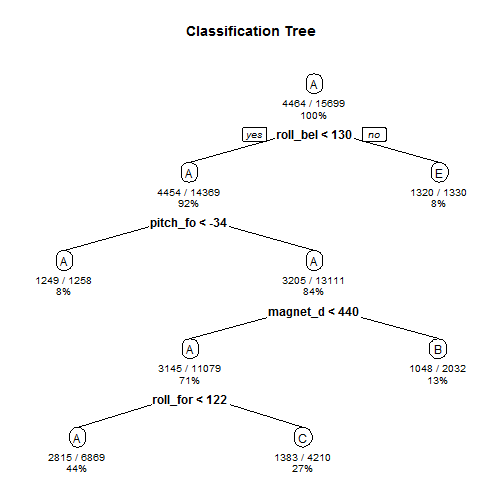

### Assignment: Prediction Assignment Writeup  
by Hoan Long Bui

#### Instructions

One thing that people regularly do is quantify ***how much of a particular activity they do***, but they rarely quantify ***how well they do it***.  
In this project, your goal will be to use data from accelerometers on the belt, forearm, arm, and dumbell of 6 participants.

#### Background

Using devices such as *Jawbone Up*, *Nike FuelBand*, and *Fitbit* it is now possible to collect a large amount of data about personal activity relatively inexpensively. These type of devices are part of the quantified self movement - a group of enthusiasts who take measurements about themselves regularly to improve their health, to find patterns in their behavior, or because they are tech geeks. One thing that people regularly do is quantify ***how much of a particular activity they do***, but they rarely quantify ***how well they do it***. In this project, your goal will be to use data from accelerometers on the belt, forearm, arm, and dumbell of 6 participants. They were asked to perform barbell lifts correctly and incorrectly in 5 different ways.  
More information is available from the website here: http://groupware.les.inf.puc-rio.br/har (see the section on the Weight Lifting Exercise Dataset).

#### Data

The training data for this project are available here:  
https://d396qusza40orc.cloudfront.net/predmachlearn/pml-training.csv

The test data are available here:  
https://d396qusza40orc.cloudfront.net/predmachlearn/pml-testing.csv

The data for this project come from this source: http://groupware.les.inf.puc-rio.br/har.

#### Objective

The goal of your project is to predict the manner in which they did the exercise. This is the "classe" variable in the training set. You may use any of the other variables to predict with. You should create a report describing how you built your model, how you used cross validation, what you think the expected out of sample error is, and why you made the choices you did. You will also use your prediction model to predict 20 different test cases.

#### 1. Data Processing


- The first 7 variables are removed from the data set as we do not want them to be included in our classification problem. The removed variables are: "X" "user_name" "raw_timestamp_part_1" "raw_timestamp_part_2" "cvtd_timestamp" "new_window" "num_window".

- The most represented classe is the classe "A" with 5580 units. The second largest classe is the classe "B" with 3797 units.


```
## 
##    A    B    C    D    E 
## 5580 3797 3422 3216 3607
```




#### 2. Data Analysis

To do cross-validation, we use the training set and split it into training and test sets.  
We build a model using the Random Forests algorithm. We then do an evaluation on the test set.  
But before splitting the data set into the training and test sets, we first remove predictors that have near zero variance. We also remove predictors which more than 75% of the data are N/a.
We finally take 80% of the data set to create the training set and the 20% left are for the testing set.


```r
# load the libraries
library(caret)
```

```
## Warning: package 'caret' was built under R version 3.2.4
```

```
## Loading required package: lattice
```

```
## Loading required package: ggplot2
```

```r
# set the seed at 1
set.seed(1)

# diagnose predictors that have one unique value
nsv <- nearZeroVar(x = pml_data, freqCut = 95/5)

# remove the nsv predictors from the data sets
pml_data <- pml_data[, -nsv]
testcases <- testcases[, -nsv]

# remove predictors with more than 75% N/a
pml_data <- pml_data[, colSums(is.na(pml_data))/nrow(pml_data) < 0.75]
testcases <- testcases[, colSums(is.na(testcases))/nrow(testcases) < 0.75]

# create a training and testing data sets
inTrain <- createDataPartition(y = pml_data$classe, p = 0.8, list = FALSE)
training <- pml_data[inTrain,]
testing <- pml_data[-inTrain,]
dim(training); dim(testing)
```

```
## [1] 15699    53
```

```
## [1] 3923   53
```

**Random forests**

The classification algorithm used is the Random forests. The number of trees has been set to 1000.  
We also plot the error vs the number of trees.


```r
# load the libraries
library(randomForest)
```

```
## Warning: package 'randomForest' was built under R version 3.2.4
```

```
## randomForest 4.6-12
```

```
## Type rfNews() to see new features/changes/bug fixes.
```

```
## 
## Attaching package: 'randomForest'
```

```
## The following object is masked from 'package:ggplot2':
## 
##     margin
```

```r
# modelling with random forest methodology
modFit_rf <- randomForest(formula = classe ~ ., data = training, ntree = 1000, importance = TRUE)
plot(modFit_rf)
```



The conclusion of the plot is that the error is convering and is stable from 100 trees. Using 1000 trees is then largely sufficient.  

To have a view on the importance of the variables, the Mean Decrease Accuracy and Mean Decrease Gini are computed:


```r
# importance of the variables
varImpPlot(x = modFit_rf, sort = TRUE, type = 1, nrow(modFit_rf$importance), cex = 0.7)
```



```r
varImpPlot(x = modFit_rf, sort = TRUE, type = 2, nrow(modFit_rf$importance), cex = 0.7)
```



We now use the model on the testing set.


```r
# prediction
pred <- predict(modFit_rf, testing)
confusionMatrix(pred, testing$classe)
```

```
## Confusion Matrix and Statistics
## 
##           Reference
## Prediction    A    B    C    D    E
##          A 1115    2    0    0    0
##          B    1  756    5    0    0
##          C    0    1  676    6    0
##          D    0    0    3  636    1
##          E    0    0    0    1  720
## 
## Overall Statistics
##                                           
##                Accuracy : 0.9949          
##                  95% CI : (0.9921, 0.9969)
##     No Information Rate : 0.2845          
##     P-Value [Acc > NIR] : < 2.2e-16       
##                                           
##                   Kappa : 0.9936          
##  Mcnemar's Test P-Value : NA              
## 
## Statistics by Class:
## 
##                      Class: A Class: B Class: C Class: D Class: E
## Sensitivity            0.9991   0.9960   0.9883   0.9891   0.9986
## Specificity            0.9993   0.9981   0.9978   0.9988   0.9997
## Pos Pred Value         0.9982   0.9921   0.9898   0.9938   0.9986
## Neg Pred Value         0.9996   0.9991   0.9975   0.9979   0.9997
## Prevalence             0.2845   0.1935   0.1744   0.1639   0.1838
## Detection Rate         0.2842   0.1927   0.1723   0.1621   0.1835
## Detection Prevalence   0.2847   0.1942   0.1741   0.1631   0.1838
## Balanced Accuracy      0.9992   0.9971   0.9931   0.9939   0.9992
```

If we look at some error measure:
- the accuracy is 0.9949
- the sensitivity and specificity for each classes are > 99.00%

#### 3. Prediction exercice

We finally apply our model on the test case set.  
The results are shown here:


```
##  1  2  3  4  5  6  7  8  9 10 11 12 13 14 15 16 17 18 19 20 
##  B  A  B  A  A  E  D  B  A  A  B  C  B  A  E  E  A  B  B  B 
## Levels: A B C D E
```

#### 4. Appendices

A model with the Recursive Partitioning and Regression Trees algorithm has been test.


```
## Warning: package 'rpart.plot' was built under R version 3.2.4
```

```
## Loading required package: rpart
```


